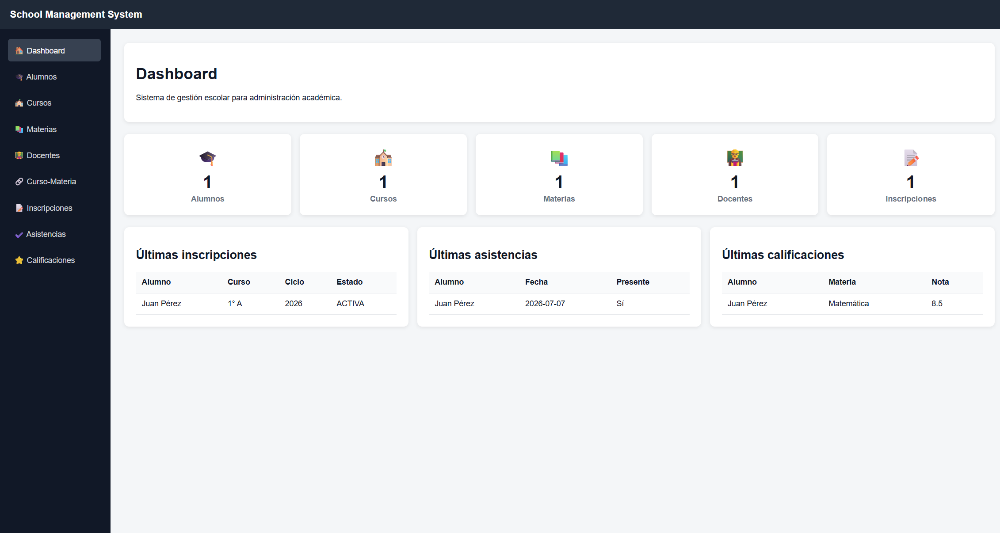

# School Management System – Software Engineering Project



A web application for managing a school's academic information, developed with **Spring Boot** and **Vanilla JavaScript** as part of the Software Engineering course.

## Features

The system provides CRUD operations for the following modules:

- Students
- Teachers
- Courses
- Subjects
- Course Subject Assignments
- School Years
- Enrollments
- Attendance
- Grades

Additionally, it includes:

- Dashboard with system overview
- OpenAPI / Swagger documentation
- Docker Compose deployment
- Sample data seeding
- Responsive administration interface

---

## Tech Stack

### Backend

- Java 21
- Spring Boot 4.1
- Spring Data JPA
- Hibernate
- MySQL 8
- Maven
- Lombok
- Springdoc OpenAPI

### Frontend

- HTML5
- CSS3
- Vanilla JavaScript

### Infrastructure

- Docker
- Docker Compose
- Nginx

---

## Project Structure

```text
school-management-system
│
├── frontend/
│   ├── css/
│   ├── js/
│   ├── pages/
│   └── index.html
│
├── src/
│   └── main/
│
├── docs/
│
├── Dockerfile
├── compose.yaml
├── pom.xml
└── README.md
```

---

## Running the project

### Requirements

- Docker Desktop

No Java or MySQL installation is required.

### Start the application

```bash
docker compose up --build
```

This command starts:

- MySQL
- Spring Boot Backend
- Frontend (Nginx)

---

## URLs

Frontend

```
http://localhost:5500
```

Backend API

```
http://localhost:8080/api
```

Swagger UI

```
http://localhost:8080/swagger-ui.html
```

---

## API Documentation

The REST API is fully documented using Swagger / OpenAPI.

Available after starting the application:

```
http://localhost:8080/swagger-ui.html
```

---

## Sample Data

When the application starts for the first time, sample data is automatically inserted into the database through the `DataSeeder`.

This includes:

- Students
- Teachers
- Courses
- Subjects
- Course assignments
- Enrollments
- Attendance records
- Grades

---

## Main Modules

- Dashboard
- Student Management
- Teacher Management
- Course Management
- Subject Management
- Course Subject Assignment
- Enrollment Management
- Attendance Management
- Grade Management

---

## Authors

- Franco Barrera